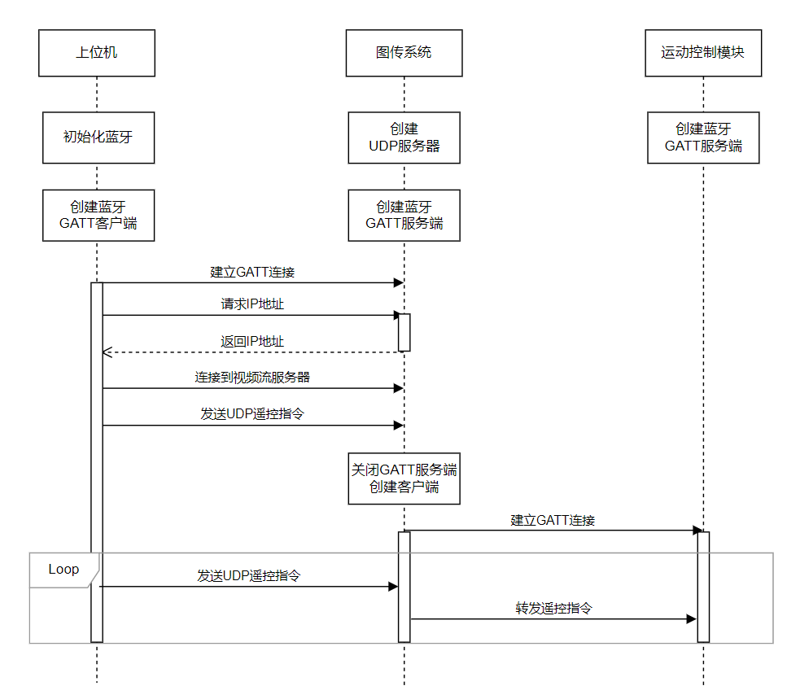

# Android App

**[简体中文](README.md) | English**

This is a sub-module of the Robot Project, developed using Android Studio, and it provides the following functionalities:

- Reads user touch inputs to send remote control commands to the robot.
- Pulls and displays the video stream from the image transmission system on the interface.
- Cooperates with the image transmission system for Bluetooth pairing.

---

## Implementation Approach

### Display Solution

Since the MJPG video stream from the image transmission system can be directly accessed in various browsers, this application directly utilizes a WebView as the main display view. Only a small amount of HTML+JavaScript code is needed to display the video stream.

Additionally, the application overrides the onDraw method of WebView to overlay controls such as joystick and sliders on top of the HTML page, and it uses the onTouchEvent method to listen for user touch inputs.

### Image Transmission Connection Solution

Regarding the communication link of the image transmission system, please refer to [Image Transmission System Solution](../linux-fpv/README_en.md#Connection%20Scheme) first.

To connect to the image transmission system, a video stream connection and UDP remote control data link need to be established over the network. The following timing diagram illustrates the process:

> Note: In the diagram, "Upper Computer" represents this application, and "Motion Control Module" represents the robot's main control module.

### Bluetooth Pairing Solution

Bluetooth pairing refers to this application establishing a direct Bluetooth connection with the image transmission system, sending network information to connect it to the specified WiFi network. Afterward, the application can connect to the image transmission system over the network automatically. The following timing diagram illustrates the process:

---

## Important Files

- `balancebot.apk`: Pre-compiled installation package for direct installation.
- `app/src/main/java/com/skythinker/balancebot`: Java source code.
	- `MainActivity.java`: Main Activity responsible for creating various module objects, receiving events, and sending remote control commands.
	- `Bluetooth.java`: Bluetooth module responsible for Bluetooth connection and data transmission.
	- `WifiClient.java`: WiFi client module responsible for creating UDP client and handling data transmission.
	- `CtrlView.java`: Main view, overrides WebView, responsible for UI drawing.
- `app/src/main/AndroidManifest.xml`: Android manifest file, declaring the program's permissions and activities.
- `app/src/main/res/drawable`: Various image resources.
- `app/src/main/assets/streamview.html`: WebView page for displaying the video stream.

---

## Usage Instructions

1. Power on the robot and wait for the image transmission system to start up (approximately 1 minute).

2. Open this application and click the configuration button in the top-left corner.

	- If not using image transmission, select "Switch to Bluetooth mode" and wait for a successful connection.
	- If using image transmission, select "Switch to image transmission mode," then click the configuration button again, and choose "Configure connection" as instructed. Select the network and enter the password as required, and wait for a successful connection.

3. The configuration button in the top-left corner will become active (from gray to lit) when the connection is successful. At this point, you can use the joystick to control the robot.

