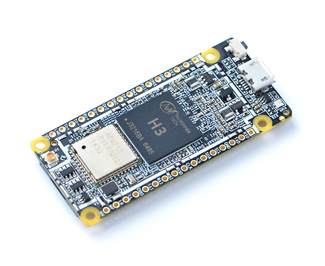
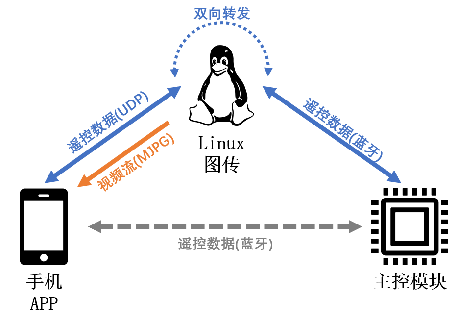

# Linux Image Transmission System

**[简体中文](README.md) | English**

This is an optional subsystem in the Robot project, developed on the NanoPI Duo2 development board.



The NanoPI Duo2 is a tiny Linux core board measuring 55 x 25.4mm, powered by the Allwinner H3 chip. It supports WiFi and low-power Bluetooth, has a camera interface, and can run either FriendlyCore (based on UbuntuCore) or FriendlyWrt (based on OpenWrt) systems.

The image transmission module of this project is based on the FriendlyCore system (Ubuntu 20.04) of NanoPI Duo2, and it implements the following features:

- Capturing video streams from the ov5640 camera and compressing them into MJPEG format using ffmpeg.
- Streaming the above video stream over HTTP protocol via ffserver for viewing on a mobile app.
- Cooperating with a mobile app to implement Bluetooth pairing, enabling various network connections through the app.
- Creating a UDP server to connect with the mobile app and a Bluetooth GATT client to connect with the main control module, enabling bidirectional data transmission for remote control.

---

## Connection Scheme



The image transmission module implements the plug-and-play scheme shown in the figure above:

- In the scenario of **not using the image transmission system**, the mobile app communicates directly with the main control module via Bluetooth for remote control data transmission (gray arrow).
- In the scenario of **using the image transmission system**, the image transmission system connects with the mobile app through a local area network (LAN) while also connecting with the main control module via Bluetooth. It streams the video (orange arrow) and forwards the remote control data received from the mobile app on the LAN to the main control module (blue arrow). In this case, the robot does not need to be within the range of the mobile app's Bluetooth; it only requires the mobile app and the image transmission system to be on the same LAN.

These two scenarios do not make any difference to the main control module, allowing for flexible switching between different scenarios or complete removal of the image transmission module.

---

## Reference Purchasing Links

> Note: The links below were valid at the time of writing and are for reference only. The availability may vary.

| Item            | Purchase Link                                                                 | Reference Price |
| :-------------- | :----------------------------------------------------------------------------: | :-------------: |
| NanoPI Duo2     | [Link](https://item.taobao.com/item.htm?spm=a1z09.2.0.0.67002e8dunEQwK&id=669016013822)   |   ￥155.00    |
| ov5640 Camera   | [Link](https://item.taobao.com/item.htm?spm=a1z09.2.0.0.67002e8dunEQwK&id=676065308445)   |   ￥20.00     |

---

## Setup Instructions

### 1. Install FriendlyCore System

1. Follow the [official documentation](https://wiki.friendlyelec.com/wiki/index.php/NanoPi_Duo2/zh) to flash the system firmware. The author installed FriendlyCore, based on Linux kernel version 4.14 and Ubuntu 20.04 (focal).

2. Connect the development board to your computer using a USB-to-serial adapter and establish a connection to the board using a serial terminal tool (such as PuTTY). Refer to the official documentation for system login and WiFi network connection.

### 2. Install and Configure ffmpeg and ffserver

1. Download ffmpeg and ffserver from [here](https://ffbinaries.com/downloads). The author used ffmpeg v3.1.4 and ffserver v3.2, and it is recommended to use similar versions.

2. Write the ffserver configuration file by copying the contents from `scripts/ffserver.conf` in this repository to `/etc/ffserver.conf`.

3. Place `scripts/start-ffmpeg.sh` in the system's `/root/balancebot/` directory and run it. Check for any errors. If there are no errors, access `http://<NanoPI's IP address>:8090/camera.mjpg` from another device on the same LAN with a web browser. If you can see the real-time camera stream, the configuration is successful (make sure to connect the camera first).

4. Copy `scripts/mjpg-ffserver.service` to `/lib/systemd/system/` and run the following command:

	```bash
	sudo systemctl daemon-reload
	```

	This will configure the image transmission service as a system service, which can be started or stopped using the following commands:

	```bash
	sudo service mjpg-ffserver start
	sudo service mjpg-ffserver stop
	```

### 3. Configure Python Control Script

1. Ensure that Python 3 is installed on the system. The author used Python 3.8.10 or higher. You can check the Python version using the following command:

	```bash
	python3 --version
	```

2. Install Python dependencies by moving `python/requirements.txt` from the current repository directory to the system, and then run the command:

	```bash
	pip3 install -r requirements.txt
	```

3. Copy the `python/ctrl-proxy.py` file from the repository to the system's `/root/balancebot/` directory. Also, copy the `scripts/ctrl-proxy.service` file to `/lib/systemd/system/`, and run the following command:

	```bash
	sudo systemctl daemon-reload
	```

	This will configure the control script as a system service, which can be started or stopped using the following commands:

	```bash
	sudo service ctrl-proxy start
	sudo service ctrl-proxy stop
	```

4. Set the Python control service to start automatically at boot by running the command:

	```bash
	sudo systemctl enable ctrl-proxy
	```

At this point, the entire image transmission system setup is completed.

---

## Areas for Improvement

- After testing, the current image quality of this solution is 640x480@25fps, and the video delay is approximately 300ms when connected directly to a mobile hotspot. Due to software compression in MJPG format, both CPU and network bandwidth usage are relatively high. You can try using a hardware encoder to compress the video into H264 format and transmit it (the author was not successful in achieving the expected results), or consider using a camera with built-in compression capabilities.

- If image quality is not a concern, you can replace the ffmpeg+ffserver solution with [mjpg-streamer](https://github.com/jacksonliam/mjpg-streamer), which offers easier configuration. However, after testing, it was found that the CPU usage is higher, and without reducing the resolution, it may not achieve a frame rate of 25fps.

